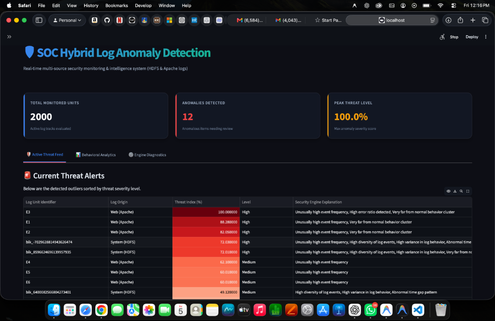

# 🛡️ SOC Hybrid Log Anomaly Detection System

An enterprise-grade, real-time security intelligence platform designed to ingest, monitor, and identify anomalies across multiple infrastructure log sources (HDFS and Apache Web Server logs). Using an unsupervised hybrid machine learning approach (Isolation Forest), the system calculates dynamic threat indices and generates human-readable Explainable AI (XAI) threat alerts.



---

## 📌 Features

- **Multi-Source Hybrid Ingestion**: Unifies infrastructure-level logs (HDFS) and application-level web server logs (Apache) into a unified feature space.
- **Dynamic Threat Indexing (0–100%)**: Scales anomaly distance from the Isolation Forest decision boundary to compute a granular threat severity score (Low, Medium, High).
- **Explainable AI (XAI) Layer**: Evaluates feature deviation from baseline normality to explain exactly *why* a particular log trace is flagged as anomalous.
- **SOC-Style Interactive Dashboard**: Real-time auto-refreshing panel featuring active threat feeds, interactive behavioral projection plots, statistics, and pipeline severity heatmaps.
- **Exportable Threat Reports**: One-click download button to export detected anomalies to CSV for incident response.

---

## 🏗️ System Architecture

```text
Log Sources (HDFS / Apache)
          │
          ▼
   Feature Ingestion & Extraction (Frequency, Variance, Time Gaps, Error Ratios)
          │
          ▼
   Hybrid Machine Learning Engine (Isolation Forest Outlier Detection)
          │
          ▼
   Severity Engine (Decision Boundary Distance -> 0-100% Index)
          │
          ▼
   Explainable AI Layer (Outlier Deviation Analysis)
          │
          ▼
   Streamlit Dashboard (Live Threat Feed, Scatter Projections, Heatmaps)
```

---

## 📂 Project Structure

```text
log_anomaly_ai/
│
├── assets/
│   └── dashboard.png                    # Dashboard preview screenshot
│
├── data/
│   ├── HDFS_2k.log_structured.csv       # Preprocessed system log samples
│   ├── Apache_2k.log_structured.csv     # Preprocessed web log samples
│   └── anomaly_label.csv                # True labels for validation
│
├── src/                                 # Step-by-step pipeline scripts
│   ├── step1_inspect_data.py            # Dataset inspector
│   ├── step2_prepare_sequences.py       # Sequence alignment script
│   ├── step3_feature_engineering.py     # Feature engineering pipeline
│   ├── step4_train_model.py             # Model training test script
│   ├── step5_evaluate_model.py          # Model evaluation test script
│   ├── step6_visualization.py           # Matplotlib visualization demo
│   ├── step7_advanced_features.py       # Time-gap and variance calculations
│   ├── step8_real_evaluation.py         # True performance verification
│   ├── realtime_simulator.py            # Simulated streaming log alerts
│   └── hybrid_system_logs.py            # Multi-source ingestion core
│
├── dashboard/
│   ├── app.py                           # Single-source prototype dashboard
│   └── hybrid_app.py                    # Multi-source SOC Dashboard
│
├── .gitignore                           # Excluded files (venv, caches, etc.)
├── requirements.txt                     # Project dependencies
└── README.md                            # Documentation
```

---

## 🔬 Feature Space & Core Engineering

Features are dynamically extracted from log pipelines:

### ⚙️ HDFS Pipeline
1. **Event Density ($f_1$)**: Total event counts per Block ID sequence.
2. **Event Diversity ($f_2$)**: Distinct Event ID count in a block.
3. **Behavioral Variance ($f_3$)**: Event sequence pattern standard deviation.
4. **Ingestion Time Gap ($f_5$)**: Mean time difference between consecutive events.

### 🌐 Apache Web Pipeline
1. **Request Intensity ($f_1$)**: Total occurrences per event template.
2. **Error Ratio ($f_4$)**: Proportion of logs containing keywords/HTTP codes representing failure (`error`, `fail`, `404`, `500`).

---

## 🚀 Installation & Setup

### 1️⃣ Clone the Repository
```bash
git clone https://github.com/<your-username>/log_anomaly_ai.git
cd log_anomaly_ai
```

### 2️⃣ Initialize and Activate Virtual Environment
```bash
python3 -m venv venv
source venv/bin/activate
```

### 3️⃣ Install Dependencies
```bash
pip install -r requirements.txt
```

---

## ▶️ Running the Applications

### Launch the SOC Dashboard
Start the real-time hybrid dashboard:
```bash
streamlit run dashboard/hybrid_app.py
```
Open your browser and navigate to `http://localhost:8501`.

### Run Pipeline Simulation
To run the live simulation terminal script highlighting alerts:
```bash
python src/realtime_simulator.py
```

### Run Model Evaluation
Verify classification precision and recall against ground truth labels:
```bash
python src/step8_real_evaluation.py
```

---

## 🧠 Machine Learning Engine Configuration

The model parameter `contamination` represents the expected proportion of outliers in the data. You can tune this dynamically in the dashboard sidebar:
- **Low Contamination (e.g. 2%)**: Captures only extreme outlier signatures, minimizing false alerts.
- **High Contamination (e.g. 10%)**: Broadens detection sensitivity to alert on subtle statistical deviations.

---

## 👨‍💻 Author
**Suryansh Dixit**  
B.Tech Computer Science & Engineering  
AI-Based Log Anomaly Detection Project
